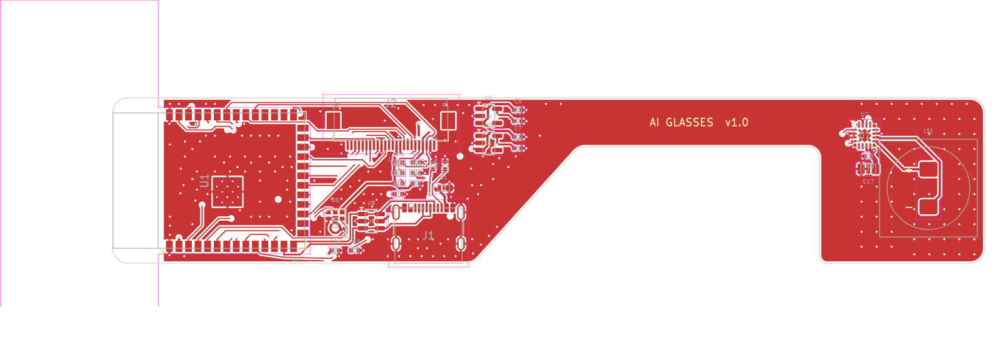
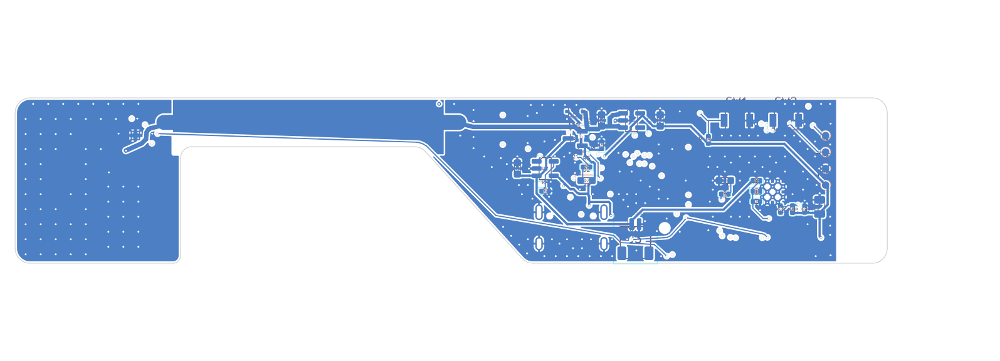

# AI Glasses – Temple PCB (KiCad)

A 4-layer board that lives inside one temple arm of a pair of AI glasses:
ESP32-S3 + camera + microphone + Li-Po charging at the front, a thin strip
over the ear, and a pad behind the ear for the bone-conduction transducer.

Open `ai_glasses.kicad_pro` in KiCad 7 or newer (8/9 will upgrade the files
on save).




## 1. Shape and dimensions (anthropometry)

The outline follows the sketch: straight top edge, full-height front section,
taper on the bottom edge only, thin strip, then a full-height pad at the back.
Dimensions come from typical adult head and ear measurements:

| Quantity (adult, typical) | Value used | Where it's used |
|---|---|---|
| Temple length (frame sizes 135–150 mm) | board ≈ 116 mm | fits a 140–145 mm temple with ~6 mm hinge housing in front and a ~20 mm plastic tip behind |
| Hinge → ear bend ("length to bend"), ≈ 95–105 mm | strip ends 100 mm from hinge | strip crosses the ear root; the rear pad starts where the arm drops behind the ear |
| Temple height where it rests on the ear (typ. 5–9 mm) | strip 6.5 mm wide | arm can be ~8–9 mm tall over the ear |
| Space behind the auricle over the mastoid (~20–25 mm) | rear pad 22 × 22 mm | amp + transducer sit on the mastoid, a good bone-conduction site |
| Front of temple (lateral orbit / temple area) | 48 × 22 mm | ESP32-S3-WROOM-1 is 18 × 25.5 mm, so 22 mm is the practical minimum height |

```
 x (mm, from board front edge; hinge is 6 mm further forward)
 0            48      62                    94          116
 +-------------+-------+---------------------+-----------+   y = 0  (top edge, straight)
 | ESP32  FPC  |  LDOs  \        strip 6.5 mm           |  |
 | (ant.) mic  |         \___________________________   |  |
 |        USB-C|             taper                     |  | rear pad
 +-------------+                                       |  | (behind ear)
                                                       +--+   y = 22
```

In the sketch the front is drawn on the right. That's the same board seen from
the bottom side (the B.Cu view in `img/bottom.png`).

If the frame bends the arm down behind the ear, mount the rear pad at that
angle. If the strip itself must bend, make the strip a flex tail
(rigid-flex) instead.

## 2. Important design decisions

**The Raspberry Pi Zero camera can't be used with an ESP32-S3.** Pi cameras
(OV5647 / IMX219 / IMX708) only have a **MIPI CSI-2** interface, and the
ESP32-S3 has no CSI-2 receiver. Its camera peripheral is 8-bit parallel
**DVP**. The board therefore uses the standard **24-pin 0.5 mm FPC DVP camera
pin-out** used by OV2640 / OV5640 modules (ESP32-CAM / ESP-EYE / Freenove).
These modules are the same size as the Pi Zero camera and come with long
ribbons (21–75 mm) and wide-angle lenses. If you must use a Pi camera, the MCU
has to change to something with CSI-2 (e.g. ESP32-P4).

**The charging board is built into the PCB** rather than being a separate
TP4056 module. It's thinner, and USB-C goes to the ESP32's native USB, so the
same port charges and programs the board.

- USB-C (5.1 k CC pull-downs → 5 V sink) → USBLC6-2SC6 ESD protection
- MCP73831 Li-Po charger, 196 mA (R4 = 5.1 k; `I = 1000 V / R4`). Set it to
  ≤ 1C of your cell.
- Load-sharing power path: Schottky from VBUS plus P-FET from the battery, so
  the system runs from USB while the battery charges.
- AP2112K-3.3 (600 mA) for the ESP32; TLV70028 (2.8 V AVDD) and TLV70012
  (1.2 V DVDD) for the camera.

**Audio**

- ICS-43434 I2S MEMS mic on I2S0 (bottom-port, acoustic hole through the PCB).
- MAX98357A I2S class-D amp on I2S1, at the back next to the transducer, so
  only digital I2S runs down the strip. Gain 12 dB; SD_MODE driven by a GPIO
  (high = on, left channel).

## 3. Power tree

```
USB-C VBUS ─┬─ USBLC6 ─ ESD
            ├─ MCP73831 ── VBAT ── JST-SH (Li-Po 1S, protected cell)
            └─ B5819WS ─┐
VBAT ── DMG3415 P-FET ──┴─ VSYS ─┬─ AP2112K-3.3 ── +3V3 ─┬─ ESP32-S3, mic, SCCB pull-ups, cam DOVDD
                                 │                       ├─ TLV70028 ── +2V8_CAM (AVDD)
                                 │                       └─ TLV70012 ── +1V2_CAM (DVDD)
                                 └─ (In2 trunk down the strip) ── MAX98357A VDD
VBAT ── 1M/1M divider ── IO4 (ADC1_CH3)
```

## 4. ESP32-S3 pin map

| GPIO | Net | GPIO | Net |
|---|---|---|---|
| IO0 | BOOT button (+10k pull-up) | IO38 | CAM_VSYNC |
| IO1 | CAM_RESET (10k pull-up) | IO39 | CAM_HREF |
| IO2 | CAM_PWDN (10k pull-down) | IO40 | CAM_XCLK |
| IO4 | VBAT_SENSE | IO41 | CAM_SIOD (4.7k pull-up) |
| IO5 / IO6 / IO7 | MIC SCK / WS / SD | IO42 | CAM_SIOC (4.7k pull-up) |
| IO15 / IO16 / IO17 | AMP BCLK / LRCLK / DIN | IO43 / IO44 | UART TX / RX test pads |
| IO18 | AMP_SD (enable) | IO9–IO14, IO21, IO47 | CAM D0–D7 (Y2–Y9) |
| IO8 | Status LED | IO48 | CAM_PCLK |
| IO19 / IO20 | USB D− / D+ | IO35–37 | **unused (octal PSRAM)** |
| EN | RC reset + RESET button | IO3, IO45, IO46 | strapping pins, left floating |

`esp_camera` config: `pin_d0=9, d1=10, d2=11, d3=12, d4=13, d5=14, d6=21,
d7=47, pclk=48, vsync=38, href=39, xclk=40, sccb_sda=41, sccb_scl=42,
pwdn=2, reset=1`.

## 5. Stack-up and rules

4 layers, 1.0 mm FR-4, 1 oz outer / 0.5 oz inner.

| Layer | Use |
|---|---|
| L1 F.Cu | components, signals, GND pour |
| L2 In1.Cu | solid GND plane (reference for every signal) |
| L3 In2.Cu | signals in the front; 1.2 mm VSYS trunk + VSYS pour down the strip; GND pour elsewhere |
| L4 B.Cu | components (power, buttons, LEDs), signals, GND pour |

- Minimum track/space: 0.15 / 0.15 mm.
- Power traces: 0.3 mm (plus the pours).
- Vias: 0.5 mm with 0.25 mm drill, through-hole.
- Board-edge copper clearance ≥ 0.25 mm; routed copper is kept 0.5 mm away.
- These are inside standard JLCPCB / PCBWay 4-layer capabilities.
- Every SMD GND pad has its own via to L2. About 130 extra GND stitching vias
  tie the pours together.
- **Antenna:** copper is kept out of all 4 layers under the WROOM-1 antenna
  (x < 6.8 mm), and the antenna sits at the board's front edge. Don't put
  metal (hinge, screws, battery) within ~15 mm of it.

## 6. How the files are produced

Everything is generated from `scripts/design.py`, which holds the parts,
every pin-to-net assignment and the placement.

```
cd scripts
python3 gen_sch.py      # schematic
python3 build.py        # board: place, GND fan-out, Freerouting autoroute, pours, stitching
python3 check_design.py # verification (below)
python3 outputs.py      # Gerbers, drill, pick-and-place, BOM, PDFs -> ../fab
./render.sh             # images in docs/img
```

Requirements: KiCad 7+, Java 17+, xvfb-run on a headless machine, and
`pip install sexpdata`. Freerouting 1.9 is downloaded on first run.

## 7. Verification

`check_design.py` checks the design independently:

- **Three-way netlist match:** design.py = schematic netlist (exported by
  KiCad) = PCB pad nets.
- **No unlabelled nets.** The only unconnected pins are the intentional NC
  pins.
- **Every symbol pin is assigned** a net or an explicit NC.
- **ERC-style checks:** no single-pin nets, every power input has a driver,
  no no-connect pins wired.
- **Circuit rules:**
  - no GPIO on a rail above 3.3 V;
  - PSRAM and strapping pins left alone;
  - USB on IO19/20;
  - divider stays inside the ADC range;
  - decoupling on every rail;
  - CC pull-downs present;
  - I2S directions correct;
  - power-path device pinning correct.
- **KiCad DRC:** 0 errors (clearance, shorts, courtyard overlaps, hole
  clearances, edge clearance) and 0 unconnected items.
- **Placement checks:**
  - every pad inside the outline;
  - no copper inside the antenna keep-out;
  - the mic acoustic port isn't covered by any bottom-side part.

See `VERIFICATION.txt` for the latest run.

## 8. Before ordering / bring-up checklist

1. **Camera FPC orientation.** The FH12-24S is a bottom-contact connector,
   and pin 1 is marked on the silkscreen side. Check your camera ribbon's
   contacts face the right way. If they don't, fold the ribbon or use the
   top-contact variant.
2. **Battery polarity.** J3 pin 1 = +, pin 2 = −. JST-SH battery leads aren't
   standardised, so check before plugging in. Use a cell with a protection
   circuit (PCM).
3. **Charge current.** R4 = 5.1 k gives ~200 mA. For a 100–150 mAh cell use
   10 k (100 mA).
4. **Transducer.** Use 4–8 Ω; MAX98357A drives either. Bone-conduction
   exciters need firm contact against the mastoid through a thin housing wall.
5. **LDO headroom.** Below ~3.5 V of battery, the AP2112K drops out under
   Wi-Fi TX peaks. Set the low-battery cut-off in firmware around 3.5 V
   (VBAT_SENSE), or swap in a buck-boost for longer runtime.
6. **Mechanical.** Import `ai_glasses.kicad_pcb` (File → Export → STEP) into
   your CAD to check fit in the temple housing. Tallest parts: USB-C 3.2 mm,
   ESP32 module 3.1 mm, FPC 2.0 mm (top); JST-SH 2.9 mm (bottom).
